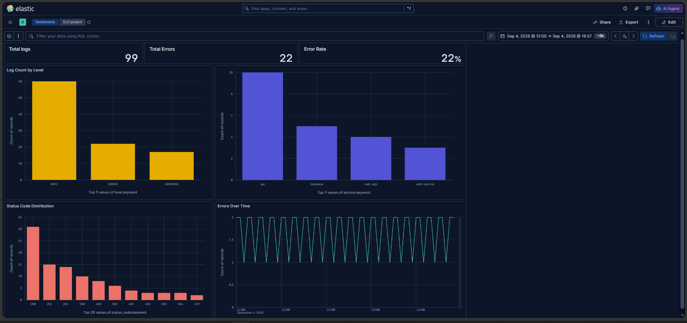
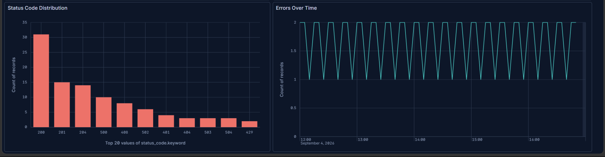
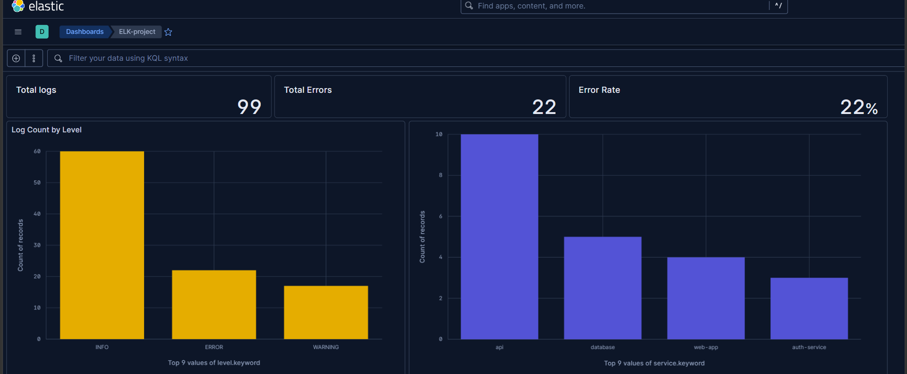

# ELK Stack Log Analytics

## 1. Project Summary

This project is an Internal Log Analytics and Search Platform based on the ELK Stack.

The platform collects, parses, stores, searches, and visualizes application logs using:

* **Elasticsearch** for storing, indexing, and searching logs
* **Logstash** for collecting and parsing log data
* **Kibana** for log visualization and analysis
* **Docker Compose** for running the ELK services
* **Terraform** for provisioning the Azure infrastructure
* **Microsoft Azure Virtual Machine** for hosting the platform

The log processing flow is:

```text
Application Logs
      ↓
   Logstash
      ↓
Elasticsearch
      ↓
    Kibana
      ↓
 Dashboards
```

The project uses an application log dataset containing **100 log records**. Logstash reads the dataset, extracts structured fields using Grok, converts the timestamp, and sends the processed records to Elasticsearch under the `project-logs` index.

Kibana connects to Elasticsearch and provides dashboards for analyzing log levels, errors, status codes, and log activity over time.

---

## 2. Requirements

### Software

The following tools are required to run the project:

* Docker Desktop
* Docker Compose
* Git (optional)
* Terraform (required only for Azure infrastructure provisioning)
* A web browser for accessing Kibana

### Docker Images

The project uses:

* Elasticsearch `9.5.3`
* Logstash `9.5.3`
* Kibana `9.5.3`

### Infrastructure

For Azure deployment:

* Microsoft Azure subscription
* Azure Virtual Machine
* Ubuntu Linux
* Terraform

No Python packages or external Python dependencies are required.

---

## 3. Installation

### Step 1: Extract the Project

Extract the project ZIP file:

```text
ELK_Stack_Group01_Code_v1/
```

### Step 2: Open the Project Directory

Open a terminal and navigate to the `02_src` directory:

```bash
cd ELK_Stack_Group01_Code_v1/02_src
```

### Step 3: Verify Docker

Make sure Docker Desktop is running:

```bash
docker --version
```

Verify Docker Compose:

```bash
docker compose version
```

No `pip install` command is required because the project does not use Python dependencies.

---

## 4. Run the Project

### Step 1: Start the ELK Stack

From the `02_src` directory, run:

```bash
docker compose up -d
```

This starts:

* Elasticsearch
* Logstash
* Kibana

### Step 2: Check the Services

Run:

```bash
docker compose ps
```

All three services should be running.

### Step 3: Verify Elasticsearch

Open:

```text
http://localhost:9200
```

Elasticsearch should return its cluster information.

### Step 4: Verify the Log Data

Check the number of documents stored in Elasticsearch:

```bash
curl -s http://localhost:9200/project-logs/_count
```

Expected result:

```text
100 documents
```

### Step 5: Verify Logstash Parsing

Check for Grok parsing failures:

```bash
curl -s "http://localhost:9200/project-logs/_count?q=tags:grokparsefailure"
```

Expected result:

```text
0 parsing failures
```

### Step 6: Open Kibana

Open:

```text
http://localhost:5601
```

Kibana can be used to search and visualize the processed log data.

The project dashboard includes:

* Total log count
* Total errors
* Error rate
* Log count by level
* Status code distribution
* Errors over time

### Stopping the Project

To stop the services:

```bash
docker compose down
```

---

## Project Visuals

The `03_assets` directory contains screenshots of the Kibana dashboards and log analysis results:

* `elk-dashboard.png` — Main ELK Stack dashboard
* `error-status-analysis.png` — Error and HTTP status code analysis
* `log-summary.png` — Log summary and overview

### Main Dashboard



### Error & Status Analysis



### Log Summary



---

## 5. API Keys & Environment Variables

The current demonstration environment does not require API keys or external application credentials.

The following configuration is used by Docker Compose:

* Elasticsearch runs on port `9200`
* Logstash runs on port `5044`
* Kibana runs on port `5601`

Kibana connects to Elasticsearch using:

```text
http://elasticsearch:9200
```

The current demonstration environment has Elasticsearch security disabled:

```text
xpack.security.enabled=false
```

No passwords, API keys, or sensitive credentials are required for the local demonstration.

For Azure deployment, Terraform requires the appropriate Azure authentication and subscription configuration. Sensitive Terraform configuration and state files are intentionally excluded from the submission package.

---

## 6. Known Issues

* Elasticsearch security and authentication are disabled in the current demonstration environment.
* Elasticsearch is configured as a single-node deployment.
* The project uses a sample application log dataset containing 100 records rather than a large production dataset.
* The current version does not include AI-based anomaly detection.
* The project is designed as a demonstration and internal log analytics platform rather than a full SIEM solution.

### Future Improvements

Possible future improvements include:

* Enabling Elasticsearch security and authentication
* Deploying a larger distributed Elasticsearch cluster
* Using larger and more diverse production-like datasets
* Adding automated alerting
* Adding AI-based anomaly detection and log analysis
* Supporting additional application log formats
